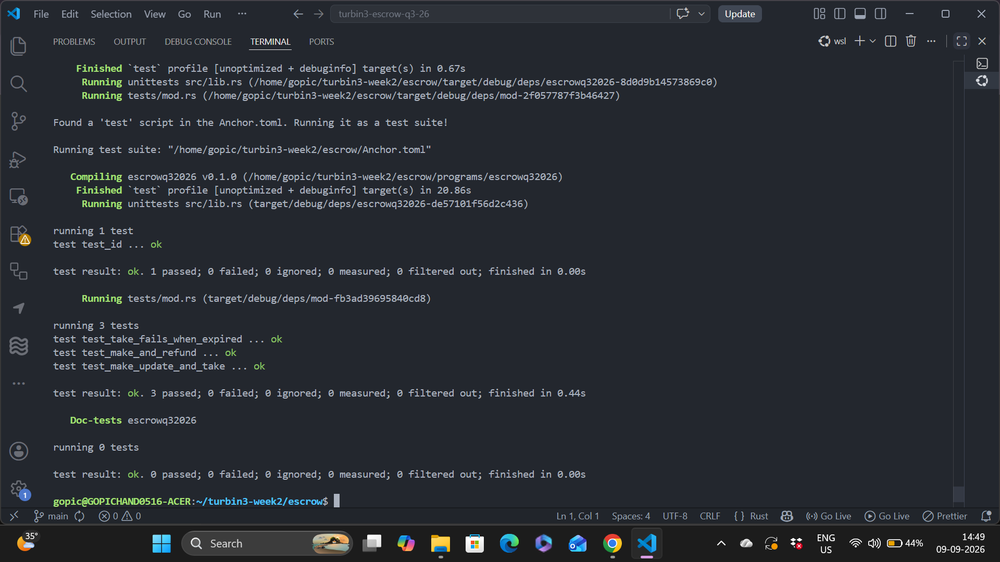

# Solana Escrow Program (Turbin3 Q3 2026)

Trustless token swap built with Anchor. Maker deposits one token, taker fills with the other. Includes a timed expiration so orders don't stay open forever.

---

## Overview

Two parties can trade tokens without trusting each other:

1. **Maker** puts Token A into a PDA vault, sets how much Token B they want, and picks an expiration time.
2. **Taker** sends the required Token B and receives Token A in one atomic transaction.
3. If nobody takes the offer before the deadline (or the maker changes their mind), the maker can refund and close everything.

The program supports both regular SPL Token and Token-2022 through `TokenInterface`.

---

## Program Details

- **Program ID**: `5t2YrH4VCvpmVsSBuqPS2rCEAGTreDNhbvXX2gRGud9g`
- **Framework**: Anchor 1.1.2
- **Token standard**: SPL Token + Token-2022 (`transfer_checked`)

---

## State

### Escrow account

| Field        | Type    | What it stores                              |
|--------------|---------|---------------------------------------------|
| `seed`       | `u64`   | Extra seed so one maker can open multiple escrows |
| `maker`      | `Pubkey`| Who created the escrow                      |
| `mint_a`     | `Pubkey`| Token the maker deposited                   |
| `mint_b`     | `Pubkey`| Token the maker wants in return             |
| `receive`    | `u64`   | Exact amount of Token B expected            |
| `bump`       | `u8`    | PDA bump                                    |
| `expiration` | `i64`   | Unix timestamp after which take is rejected |

### PDA seeds

```text
escrow PDA  = ["escrow", maker, seed.to_le_bytes()]
vault ATA   = associated token account of mint_a owned by the escrow PDA
```

---

## Instructions

### `make`
Creates the escrow account and moves Token A from the maker into the vault.

- Args: `seed`, `deposit`, `receive`, `expiration`
- Signer: Maker

### `take`
Atomic swap:
1. Taker sends `receive` amount of Token B to the maker
2. Vault sends all Token A to the taker (signed by the escrow PDA)
3. Vault and escrow accounts are closed, rent goes back to the maker

Also checks the Clock sysvar — if current time is past `expiration` the instruction fails with `EscrowExpired`.

- Args: none
- Signer: Taker

### `refund`
Maker cancels the deal, gets Token A back, and closes both the vault and the escrow account.

- Args: none
- Signer: Maker

### `update`
Maker can change the `receive` amount while the escrow is still open.

- Args: `receive`
- Signer: Maker

---

## Project Layout

```text
turbin3-escrow-q3-26/
├── Anchor.toml
├── programs/escrowq32026/
│   ├── src/
│   │   ├── lib.rs
│   │   ├── state.rs
│   │   ├── error.rs
│   │   ├── constants.rs
│   │   ├── instructions/
│   │   │   ├── make.rs
│   │   │   ├── take.rs
│   │   │   ├── refund.rs
│   │   │   └── update.rs
│   │   └── instructions.rs
│   └── tests/
│       └── mod.rs
├── arch/                     # flow diagrams
│   ├── make.png
│   ├── take.png
│   └── refund.png
└── week2_escrow_tests_success.png   # test proof
```

---

## Build & Test

```bash
anchor build
cargo test --package escrowq32026 --test mod -- --nocapture
```

Tests run with LiteSVM (no local validator needed).

### What the tests cover

- `test_make_and_refund` — create escrow, deposit, refund, accounts closed
- `test_make_update_and_take` — full happy path including updating the receive amount then taking
- `test_take_fails_when_expired` — clock is moved past expiration, take correctly rejects

### Test Result



```
```

## Notes

- The vault program for this week is already finished in another repo.
- The `Take` accounts struct was large enough to hit Solana's stack limit, so the heavier accounts were boxed.
- Expiration is enforced with the real Clock sysvar so the timed-escrow extension is covered.
